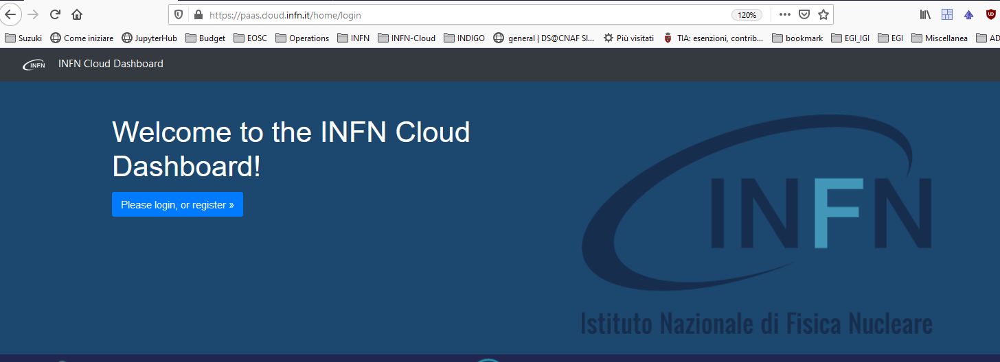
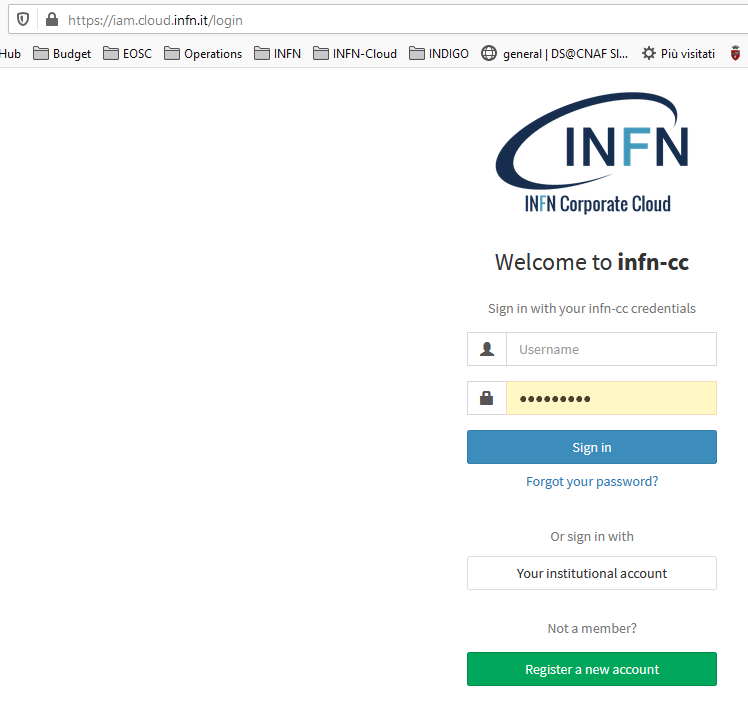
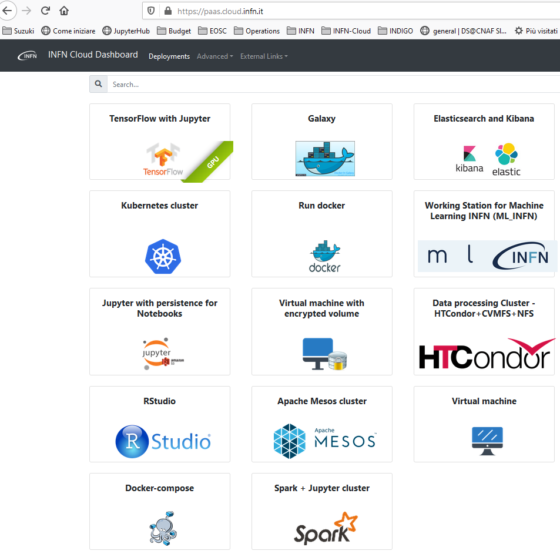
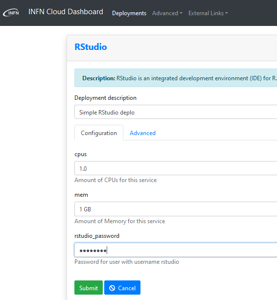
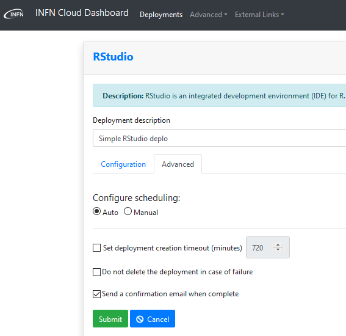
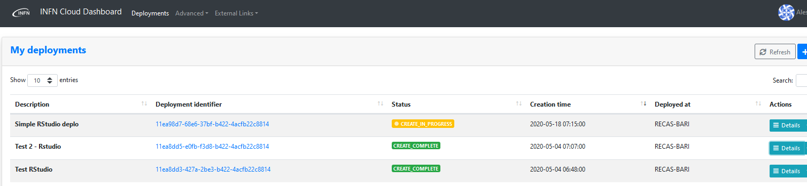
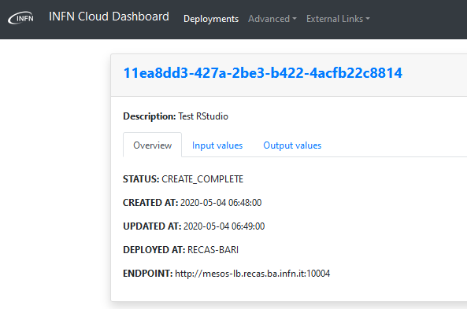
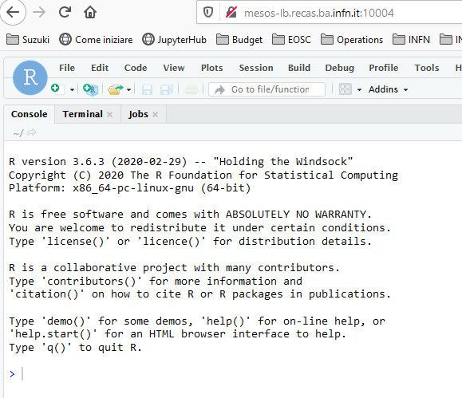

How To: Deploy RStudio application
=========================

:Author: Alessandro Costantini
:Version: 1
:Copyright: This document has been placed in the public domain.

.. contents::

1. Prerequisites
================
The user has to be registered in the IAM system for INFN-CLOUD https://iam.cloud.infn.it/login. Only registered users can login into the INFN-CLOUD dashboard https://paas.cloud.infn.it/login.

The access to the INFN-CLOUD dashboard enable the user to  instantiate RStudio.

2. Notes for the reader
=======================
The current deployment does not support the GPU implementation. Only CPU implementation is avaialble.
Selecting providers with GPU resources  (see **Step 2 - Select and Configure the RStudio deployment**) does not enable the use of GPU in the deployed RStudio application.

3. How to deploy and access RStudio
===================================

RStudio is an integrated development environment (IDE) for R that  includes a console, syntax-highlighting editor that supports direct code execution, as well as tools for plotting, history, debugging and workspace management.

Step 1 - Connecting and autheniceting to the INFN-CLOUD dashboard
-----------------------------------------------------------------

Connecting to the INFN-CLOUD dashboard (https://paas.cloud.infn.it/), the user can authenticate with the credentials used for the IAM account (https://iam.cloud.infn.it/login) in order to access the dashboard.

Fig 1: INFN-CLOUD welcome dashboard

Fig2: INFN-CLOUD IAM login

Step 2 - Select and Configure the RStudio deployment
-----------------------------------------------------------------

Once logged in, the user can select the RStudio application (see Fig.3) to access in the deployment windows and insert the required values.

After selecting RStudio from the list of applications, the user is redirected to the deployment setting window (see Fig. 4 and Fig. 5).
Here the user has to fill the required mandatory filed:

* Deployment description

  * A brief description of the deployment
  
* Configuration TAB

  * Cpus
  
    * Nuber of CPU to be used for the deployment
    
  * Mem
  
    * RAM memory to be used for the deployment
    
  * rstudio_password
  
    * Password to access the application (**by default “rstudio” is used as account name**)

* Advanced TAB

  * Scheduling
  
    * Automatic (Default)
    
      * The system will choose the most suitable provider for the deployment
      
    * Manual
    
      * A provider can be selected from the list (see **Note1**)
      
    * The following extra-settings can be set
    * Deployment creation timeout (minutes)
    
      * The deployment will fail when the timeout is reached
      
    * Do not delete the deployment in case of failure
    * Send a confirmation email when complete

**Note1**: Selecting providers with GPU resources does not enable the use of GPU in the deployed RStudio application. See section 2 "**Notes for the reader**".

Fig3: INFN-CLOUD Dashboard applications

Fig4: Rstudio deployment settings – Configuration

Fig5: Rstudio deployment settings - Advanced

Step 3  - Submitting the RStudio Deployment
-----------------------------------------------------------------

After submitting the deployment (green button in Fig. 5), the user is redirected to the deployment list (see Fig. 6) where he or she can follow the evolution of the deployment.

Once successful deployment completion ("CREATE_COMPLETE" in Fig. 6), the user can reach the deployed RStudio application by using the link available by clicking:

* to the link of **Deployment identifier**
* to the **Details** button at the end of the row
    

Fig6: User deployment list    

Step 4 - Operate with the deployed RStudio application
-----------------------------------------------------------------

Following the link at the ENDPOINT, the user is redirected to the RStudio application that can be accessed  by using the credential defined during the deployment configuration phase.

At this phase, the user can enjoy RStudio!

Fig7: User deployment details

Fig8: RStudio dashboard after successful login
